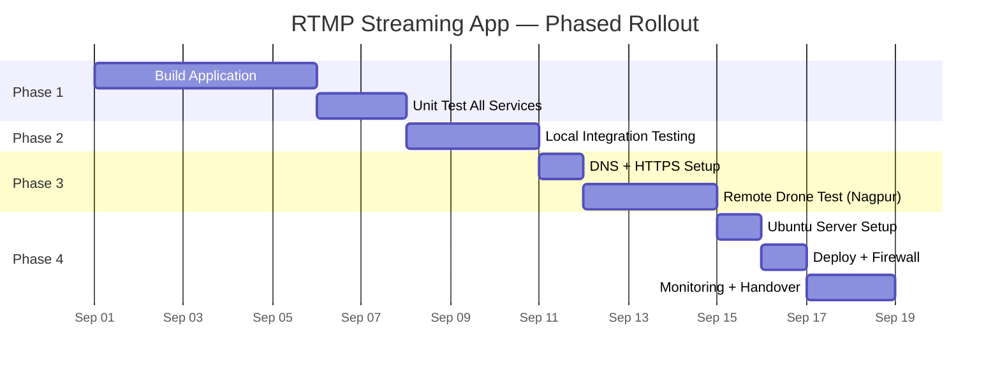

# Phased Rollout Plan — RTMP Live Streaming Application

## Resolved Parameters

| Parameter | Value |
|:----------|:------|
| **Streaming Server IP** | `172.16.3.50` |
| **NAS IPs** | `172.16.3.3`, `172.16.3.4` |
| **Gateway** | `172.16.3.1` |
| **Web Server (existing)** | `172.16.3.39` |
| **Media Server (disabled)** | `172.16.3.15` |
| **AI/ML Server (disabled)** | `172.16.3.70` |
| **Domain** | `live.dhanushuav.com` |
| **Max concurrent viewers** | 1–2 |
| **Office internet** | 400 Mbps |
| **Server room internet** | 20 Mbps leased line (plenty for 1-2 viewers) |

---

## Rollout Timeline Overview



---

## Phase 1: Build the Application (Office — ~1 Week)

> **Goal**: Build all components, get everything running on your development machine with `docker compose up`.
>
> **Where**: Your office machine (Windows/WSL2 or direct), 400 Mbps internet.

---

### Day 1–2: Project Scaffolding + MediaMTX + API Server

#### Task 1.1 — Create project structure and Docker Compose

```bash
mkdir -p rtmp-streamer/{mediamtx,server/src/routes,server/src/middleware,client/src/{pages,components},nginx,scripts}
cd rtmp-streamer
```

Create all infrastructure files:
- `docker-compose.yml` — 3 services (MediaMTX, server, client)
- `.env` / `.env.example`
- `mediamtx/mediamtx.yml` — recording enabled, auth hooks configured

#### Task 1.2 — Build API Server (Node.js + SQLite)

Files to create:
- `server/Dockerfile`
- `server/package.json` + `server/tsconfig.json`
- `server/src/index.ts` — Express app entry
- `server/src/db.ts` — SQLite schema (streams, recordings, users, logs)
- `server/src/cron.ts` — 7-day recording cleanup
- `server/src/routes/streams.ts` — CRUD stream keys
- `server/src/routes/recordings.ts` — VOD management + keep/delete
- `server/src/routes/auth.ts` — Login/logout/guest
- `server/src/routes/hooks.ts` — MediaMTX auth + publish/unpublish webhooks
- `server/src/middleware/session.ts`
- `server/src/middleware/optionalAuth.ts`

#### ✅ Day 1–2 Checkpoint

```bash
# Build and start API + MediaMTX
docker compose up -d mediamtx server

# Verify MediaMTX is running
curl http://localhost:9997/v3/paths/list
# Expected: {"items":[],"pageCount":0}  ✅

# Verify API is running
curl http://localhost:5011/api/health
# Expected: {"status":"ok","uptime":...}  ✅

# Create a test stream key via API
curl -X POST http://localhost:5011/api/streams \
  -H "Content-Type: application/json" \
  -d '{"name":"Test Drone","is_public":true}'
# Expected: {"id":1,"name":"Test Drone","stream_key":"abc123...","rtmp_url":"rtmp://localhost:1935/live/abc123..."}  ✅

# Push a test stream via FFmpeg
ffmpeg -re -f lavfi -i "testsrc2=size=1280x720:rate=30" \
       -f lavfi -i "sine=frequency=440:sample_rate=44100" \
       -c:v libx264 -preset ultrafast -tune zerolatency -b:v 2500k \
       -c:a aac -b:a 128k -t 15 -f flv \
       rtmp://localhost:1935/live/YOUR_STREAM_KEY

# Verify MediaMTX shows the active stream
curl http://localhost:9997/v3/paths/list
# Expected: items contains "live/YOUR_STREAM_KEY" with ready=true  ✅

# Verify recording was saved
ls -la recordings/live/YOUR_STREAM_KEY/
# Expected: .mp4 file with timestamp  ✅

# Verify recording logged in API
curl http://localhost:5011/api/recordings
# Expected: recording entry with duration, file_size  ✅
```

| Check | Pass Criteria |
|:------|:-------------|
| MediaMTX API responds | `curl :9997` returns JSON |
| API health | `curl :5011/api/health` returns ok |
| Stream key creation | POST returns stream_key + RTMP URL |
| FFmpeg → RTMP ingest | MediaMTX shows path as ready |
| Auto-recording | .mp4 file exists in recordings dir |
| Recording in DB | API /recordings returns the entry |

---

### Day 3–4: Build Frontend (React Dashboard + Players)

#### Task 1.3 — Web Dashboard

Files to create:
- `client/Dockerfile` (multi-stage: node build → nginx serve)
- `client/package.json` + `client/vite.config.ts` + `client/index.html`
- `client/src/App.tsx` — Router setup
- `client/src/pages/Login.tsx` — Login + "Continue as Guest"
- `client/src/pages/Dashboard.tsx` — Stream list, create/manage streams
- `client/src/pages/LivePlayer.tsx` — WebRTC + HLS live viewer
- `client/src/pages/Recordings.tsx` — VOD dashboard with retention badges
- `client/src/pages/RecordingPlayer.tsx` — VOD playback with seek/download
- `client/src/components/WebRTCPlayer.tsx` — WHEP client
- `client/src/components/HLSPlayer.tsx` — HLS.js wrapper
- `client/src/components/StreamCard.tsx` — Live/offline stream cards
- `client/src/components/RecordingCard.tsx` — Recording cards with keep/delete
- `nginx/default.conf` — Serves built app, proxies /api to server

#### ✅ Day 3–4 Checkpoint

```bash
# Build and start all services
docker compose up -d --build

# Open dashboard
# Browser → http://localhost:3000
```

| Check | Pass Criteria |
|:------|:-------------|
| Dashboard loads | `http://localhost:3000` shows login page |
| Login works | Admin can log in with configured credentials |
| Guest access | "Continue as Guest" shows public streams |
| Create stream | New stream key generated, RTMP URL displayed |
| Copy RTMP URL | Click-to-copy works for RTMP URL |

---

### Day 5: Recording Features + Cleanup Cron

#### Task 1.4 — Recording management

- VOD dashboard showing recordings with thumbnails
- "Keep" toggle per recording (exempts from auto-delete)
- Manual delete button
- Download button (serves .mp4 with range requests for seeking)
- Storage stats bar
- 7-day auto-delete cron (runs hourly)

#### ✅ Day 5 Checkpoint

```bash
# Push a 30-second test stream
ffmpeg -re -f lavfi -i "testsrc2=size=1280x720:rate=30" \
       -f lavfi -i "sine" \
       -c:v libx264 -preset ultrafast -tune zerolatency \
       -c:a aac -t 30 -f flv \
       rtmp://localhost:1935/live/YOUR_STREAM_KEY

# After stream stops, check Recordings page in browser
# Browser → http://localhost:3000/recordings
```

| Check | Pass Criteria |
|:------|:-------------|
| Recording appears | Shows in Recordings page after stream stops |
| Playback works | Click recording → video plays with seek bar |
| Download works | .mp4 downloads to browser |
| "Keep" toggle | Badge changes to "Kept ✓" (green) |
| Default badge | Unmarked recording shows "Expires in 7 days" |
| Delete works | Recording removed from list and disk |
| Storage stats | Shows total used, kept vs. expiring count |

---

### Day 6–7: Live Playback Testing

#### Task 1.5 — WebRTC and HLS player testing

Start a **continuous** test stream (runs indefinitely):
```bash
ffmpeg -re -f lavfi -i "testsrc2=size=1280x720:rate=30" \
       -f lavfi -i "sine=frequency=440" \
       -c:v libx264 -preset ultrafast -tune zerolatency -b:v 3000k \
       -c:a aac -b:a 128k -f flv \
       rtmp://localhost:1935/live/YOUR_STREAM_KEY
```

Test all playback methods:

| Method | How to Test | Expected Latency |
|:-------|:-----------|:----------------|
| **WebRTC (Dashboard)** | `http://localhost:3000/watch/YOUR_KEY` → WebRTC mode | **< 500ms** |
| **HLS (Dashboard)** | Same URL → click "Switch to HLS" | **2–5s** |
| **VLC (RTMP)** | VLC → Network → `rtmp://localhost:1935/live/YOUR_KEY` | **~1s** |
| **VLC (HLS)** | VLC → Network → `http://localhost:8888/live/YOUR_KEY/index.m3u8` | **3–6s** |

#### ✅ Day 6–7 Checkpoint

| Check | Pass Criteria |
|:------|:-------------|
| WebRTC plays | Video visible in < 1s, latency < 500ms |
| HLS plays | Video starts within 5s |
| WebRTC ↔ HLS toggle | Switch works without page reload |
| "🔴 Recording" indicator | Shows during live stream |
| Stream goes offline | Dashboard shows "Offline" badge when FFmpeg stops |
| Auto-reconnect | WebRTC player reconnects if stream restarts |
| Auth: public stream | Viewable without login ✅ |
| Auth: private stream | Redirects to login if not authenticated ✅ |
| VLC RTMP | Plays in VLC |
| VLC HLS | Plays in VLC |
| Multiple tabs | 2 browser tabs watching same stream simultaneously |

---

## Phase 2: Local Integration Testing (~3 Days)

> **Goal**: Simulate real-world scenarios — OBS Studio, multiple drones, stress testing, and edge cases.
>
> **Where**: Same office machine, 400 Mbps internet.

---

### Day 8: OBS Studio Integration

#### Task 2.1 — Test with OBS Studio (simulates real streaming software)

1. Open OBS Studio
2. Settings → Stream:
   - Service: **Custom**
   - Server: `rtmp://localhost:1935/live/`
   - Stream Key: `YOUR_STREAM_KEY` (from Dashboard)
3. Settings → Output:
   - Encoder: x264 (or NVENC if available)
   - Rate Control: CBR
   - Bitrate: 3000 kbps
   - Keyframe Interval: 1s
   - Profile: Baseline
   - Tune: zerolatency
4. Start Streaming

#### ✅ Day 8 Checkpoint

| Check | Pass Criteria |
|:------|:-------------|
| OBS connects | OBS shows "Live" with green indicator |
| Dashboard shows live | Stream card shows "🟢 Live" badge |
| WebRTC playback | Smooth video, < 500ms latency |
| Recording started | "🔴 Recording" indicator visible |
| OBS stops | Dashboard shows "Offline", recording saved |
| Recording playback | Recorded video plays correctly in VOD dashboard |

---

### Day 9: Multi-Stream + Edge Cases

#### Task 2.2 — Multiple simultaneous streams

Create 3 stream keys in Dashboard, push 3 concurrent FFmpeg streams:

```bash
# Terminal 1 — "Drone Alpha"
ffmpeg -re -f lavfi -i "testsrc2=size=1280x720:rate=30" \
       -c:v libx264 -preset ultrafast -tune zerolatency -b:v 2000k \
       -c:a aac -f flv rtmp://localhost:1935/live/DRONE_ALPHA_KEY

# Terminal 2 — "Drone Beta"
ffmpeg -re -f lavfi -i "smptebars=size=1280x720:rate=30" \
       -c:v libx264 -preset ultrafast -tune zerolatency -b:v 2000k \
       -c:a aac -f flv rtmp://localhost:1935/live/DRONE_BETA_KEY

# Terminal 3 — "Drone Gamma"
ffmpeg -re -f lavfi -i "life=size=1280x720:rate=30" \
       -c:v libx264 -preset ultrafast -tune zerolatency -b:v 2000k \
       -c:a aac -f flv rtmp://localhost:1935/live/DRONE_GAMMA_KEY
```

Test edge cases:

```bash
# Invalid stream key — should be rejected
ffmpeg -re -f lavfi -i "testsrc2=size=640x480:rate=30" \
       -c:v libx264 -preset ultrafast -c:a aac -t 5 -f flv \
       rtmp://localhost:1935/live/INVALID_KEY_12345
# Expected: FFmpeg connection refused / error  ✅

# Deactivated stream key — disable a key in Dashboard, then try to push
# Expected: FFmpeg connection refused  ✅

# Abrupt disconnect — kill FFmpeg with Ctrl+C mid-stream
# Expected: Recording saved (fmp4 format is crash-safe), Dashboard shows Offline  ✅

# Rapid reconnect — stop and restart FFmpeg within 2 seconds
# Expected: New recording file created, old one finalized  ✅
```

#### ✅ Day 9 Checkpoint

| Check | Pass Criteria |
|:------|:-------------|
| 3 streams simultaneously | All 3 show "Live" on Dashboard |
| All 3 recording | 3 separate .mp4 files being written |
| Watch each stream | WebRTC works for each individually |
| Invalid key rejected | FFmpeg gets connection error |
| Disabled key rejected | FFmpeg gets connection error |
| Crash recovery | Abrupt disconnect → recording still playable |
| Rapid reconnect | New recording created cleanly |

---

### Day 10: Recording Lifecycle + Cleanup Test

#### Task 2.3 — Verify 7-day auto-delete logic

Since we can't wait 7 actual days, test with a shortened retention:

```bash
# Temporarily set retention to 2 minutes for testing
docker compose exec server sh -c 'export RECORDING_RETENTION_DAYS=0.001 && ...'
# Or: modify .env to RECORDING_RETENTION_MINUTES=2 for testing
```

1. Push a 10-second test stream → recording created
2. Do NOT click "Keep"
3. Wait for cron to run (trigger manually or wait for next hourly cycle)
4. Verify: recording auto-deleted from disk AND from API

Then test the "Keep" flow:

1. Push another 10-second test stream → recording created
2. Click "Keep" in the VOD dashboard
3. Wait for cron cycle
4. Verify: **recording is NOT deleted** (Keep flag protects it)
5. Un-keep it → next cron cycle deletes it

```bash
# Manually trigger cleanup for testing (call the cron endpoint)
curl -X POST http://localhost:5011/api/recordings/cleanup
# Expected: {"deleted":1,"freedBytes":...}  ✅

# Verify the kept recording survived
curl http://localhost:5011/api/recordings
# Expected: kept recording still present  ✅
```

#### ✅ Day 10 Checkpoint

| Check | Pass Criteria |
|:------|:-------------|
| Un-kept recording auto-deleted | File gone from disk + removed from API |
| "Kept" recording survives | File and DB entry still present after cleanup |
| Un-keep then delete | Removing keep flag → next cleanup deletes it |
| Manual delete | Immediate delete works regardless of keep status |
| Storage stats update | Dashboard stats reflect changes |
| Cron log output | Server logs show "Cleanup: deleted N recordings, freed X GB" |

---

## Phase 3: Remote Drone Test — Nagpur → Office (~4 Days)

> **Goal**: Validate the complete end-to-end flow over the internet: drone at Nagpur pushes RTMP to your office in Kolkata, viewers watch from anywhere.
>
> **Where**: Your office is the server (400 Mbps). Drone team is at Nagpur.

---

### Day 11: DNS + HTTPS + Port Forwarding Setup

#### Task 3.1 — Point domain to your office IP

1. Log into **Cloudflare Dashboard** → DNS for `dhanushuav.com`
2. Add these DNS records:

| Type | Name | Value | Proxy | TTL |
|:-----|:-----|:------|:------|:----|
| **A** | `live` | `YOUR_OFFICE_PUBLIC_IP` | **DNS only** (grey cloud ☁️) | Auto |

> [!WARNING]
> Use **DNS only** (grey cloud), NOT "Proxied" (orange cloud). Proxied would route video through Cloudflare which violates free tier TOS. DNS-only just resolves the hostname to your IP.

3. Verify DNS resolves:
```bash
nslookup live.dhanushuav.com
# Expected: YOUR_OFFICE_PUBLIC_IP  ✅
```

#### Task 3.2 — Configure Caddy for automatic HTTPS

Add Caddy to Docker Compose (or run standalone):

```yaml
# In docker-compose.yml, add:
  caddy:
    image: caddy:2-alpine
    ports:
      - "443:443"
      - "80:80"
    volumes:
      - ./caddy/Caddyfile:/etc/caddy/Caddyfile
      - caddy-data:/data
    depends_on:
      - server
      - client
    restart: unless-stopped
```

```
# caddy/Caddyfile
live.dhanushuav.com {
    # Dashboard
    reverse_proxy /api/* server:5011

    # HLS playback (proxied for HTTPS)
    reverse_proxy /hls/* mediamtx:8888 {
        header_up Host {upstream_hostport}
    }

    # WebRTC WHEP signaling (HTTP POST)
    reverse_proxy /whep/* mediamtx:8889 {
        header_up Host {upstream_hostport}
    }

    # Frontend (default)
    reverse_proxy client:80
}
```

#### Task 3.3 — Port forward on office router

On your **office router** (not USG — that's server room):

| External Port | → Internal | Protocol | Purpose |
|:-------------|:-----------|:---------|:--------|
| **443** | Your machine:443 | TCP | HTTPS (Caddy) |
| **80** | Your machine:80 | TCP | HTTP → HTTPS redirect (Caddy) |
| **1935** | Your machine:1935 | TCP | RTMP drone ingest |

#### ✅ Day 11 Checkpoint

```bash
# From any external machine (or use phone on mobile data):
curl https://live.dhanushuav.com/api/health
# Expected: {"status":"ok"}  ✅ (HTTPS works!)

# Verify RTMP is reachable from outside
# (Quick test from a cloud VM or ask Nagpur team to try)
ffmpeg -re -f lavfi -i "testsrc2=size=640x480:rate=15" \
       -c:v libx264 -preset ultrafast -c:a aac -t 5 -f flv \
       rtmp://live.dhanushuav.com:1935/live/TEST_KEY
# Expected: Connects and streams  ✅
```

| Check | Pass Criteria |
|:------|:-------------|
| DNS resolves | `live.dhanushuav.com` → your IP |
| HTTPS works | `https://live.dhanushuav.com` shows dashboard with valid cert |
| HTTP redirects | `http://live.dhanushuav.com` → redirects to HTTPS |
| RTMP reachable | FFmpeg from external network can publish |
| Dashboard functional | Can login, create streams, see list |

---

### Day 12–14: Live Drone Test (Nagpur → Kolkata)

#### Task 3.4 — Pre-flight preparation

1. Create a stream key in Dashboard: **"Nagpur Drone Alpha"**
2. Note the RTMP URL: `rtmp://live.dhanushuav.com:1935/live/{stream_key}`
3. Share with the **Nagpur drone team**:

```
╔══════════════════════════════════════════════════════════════╗
║  DRONE RTMP CONFIGURATION                                   ║
╠══════════════════════════════════════════════════════════════╣
║  Stream Type:    Custom RTMP                                 ║
║  Server URL:     rtmp://live.dhanushuav.com:1935/live/       ║
║  Stream Key:     {stream_key}                                ║
║  Resolution:     720p (recommended for testing)              ║
║  Bitrate:        3000 kbps                                   ║
║  Keyframe:       1 second                                    ║
╚══════════════════════════════════════════════════════════════╝
```

> [!TIP]
> If the drone doesn't support custom RTMP directly, the Nagpur team can:
> 1. Connect drone video output to a laptop
> 2. Use **OBS Studio** on the laptop to push RTMP to `live.dhanushuav.com:1935`
> 3. This is actually more reliable and gives more control over encoding settings

#### Task 3.5 — Live drone test protocol

**Coordination**: Phone/WhatsApp call with the Nagpur team during the test.

```
Test Script:
─────────────────────────────────────────────────
1. [Nagpur] Start drone, begin RTMP stream
2. [Kolkata] Confirm Dashboard shows "🟢 Live"        → ✅ / ❌
3. [Kolkata] Open WebRTC player, note timestamp        → ✅ / ❌
4. [Kolkata] Ask Nagpur to wave at camera, time it     → Latency: ___ms
5. [Kolkata] Check "🔴 Recording" indicator            → ✅ / ❌
6. [Kolkata] Switch to HLS player, verify playback     → ✅ / ❌
7. [Any location] Open on phone (mobile data)          → ✅ / ❌
8. [Nagpur] Land drone, stop stream
9. [Kolkata] Confirm Dashboard shows "Offline"         → ✅ / ❌
10. [Kolkata] Open Recordings page, verify recording   → ✅ / ❌
11. [Kolkata] Play back recording, check quality       → ✅ / ❌
12. [Kolkata] Click "Keep" on the recording            → ✅ / ❌
─────────────────────────────────────────────────
```

#### Task 3.6 — Latency measurement

Have Nagpur team point camera at a phone showing a **live clock** (seconds):

```
Drone camera → clock showing 14:30:05.3
Your screen  → shows            14:30:05.7   ← WebRTC
                                              = ~400ms latency ✅

Your screen  → shows            14:30:02.1   ← HLS
                                              = ~3.2s latency ✅
```

#### Task 3.7 — Extended duration test

Run a **2-hour continuous stream** to test stability:

| Time | Check |
|:-----|:------|
| 0 min | Stream starts, WebRTC playing, recording started |
| 15 min | Still live? WebRTC smooth? Dashboard correct? |
| 30 min | Memory usage of containers stable? |
| 60 min | Recording file growing? No dropped frames? |
| 90 min | CPU/temperature normal? |
| 120 min | Stop stream. Recording finalized? Playback OK? |

```bash
# Monitor container resources during test
docker stats --format "table {{.Name}}\t{{.CPUPerc}}\t{{.MemUsage}}\t{{.NetIO}}"
```

#### ✅ Phase 3 Checkpoint (All Must Pass Before Phase 4)

| # | Check | Pass Criteria | Result |
|:--|:------|:-------------|:-------|
| 1 | Drone connects from Nagpur | Dashboard shows "Live" within 5s | |
| 2 | WebRTC latency | < 800ms (Nagpur → Kolkata) | |
| 3 | HLS latency | < 6s | |
| 4 | Recording auto-starts | .mp4 file created on drone takeoff | |
| 5 | Recording auto-stops | .mp4 finalized when drone lands | |
| 6 | Recording playback | Full duration, seekable, good quality | |
| 7 | "Keep" works | Marked recording survives cleanup | |
| 8 | Mobile viewer | Works on phone over mobile data | |
| 9 | 2-hour stability | No crashes, stable CPU/memory | |
| 10 | Auth: public stream | Guest viewer can watch without login | |
| 11 | Auth: private stream | Requires login to view | |
| 12 | Invalid key rejected | Random RTMP push is blocked | |

> [!CAUTION]
> **Do NOT proceed to Phase 4 until ALL 12 checks pass.** Fix any issues while you still have the easy 400 Mbps office setup for debugging.

---

## Phase 4: Server Room Migration (~4 Days)

> **Goal**: Deploy to the production server at `172.16.3.50` in the server room, configure USG firewall, update DNS, and verify everything works.
>
> **Where**: Server room, LAN `172.16.3.0/24`, 20 Mbps leased line.

---

### Day 15: Ubuntu Server Setup (172.16.3.50)

#### Task 4.1 — Install Ubuntu Server 24.04 LTS

1. Download Ubuntu Server 24.04 LTS ISO
2. Create bootable USB (use Rufus on Windows)
3. Install on the i7-12th Gen / 64GB / 3060Ti machine
4. During install:
   - Hostname: `rtmp-streamer`
   - Username: `streamer` (NOT root)
   - Enable OpenSSH server
   - Partition: SSD #1 for OS, SSD #2 mounted at `/opt/rtmp-streamer/recordings`

#### Task 4.2 — Configure static IP

```bash
# SSH into the new server from your laptop on the same LAN
ssh streamer@172.16.3.50

# Edit netplan
sudo nano /etc/netplan/01-netcfg.yaml
```

```yaml
network:
  version: 2
  ethernets:
    enp0s31f6:           # Check your interface: ip link show
      dhcp4: no
      addresses:
        - 172.16.3.50/24
      routes:
        - to: default
          via: 172.16.3.1
      nameservers:
        addresses: [8.8.8.8, 1.1.1.1]
```

```bash
sudo netplan apply

# Verify
ip addr show
ping 172.16.3.1        # Gateway  ✅
ping 8.8.8.8           # Internet ✅
ping google.com        # DNS      ✅
```

#### Task 4.3 — Run setup script

```bash
# Copy the project to the server
scp -r rtmp-streamer/ streamer@172.16.3.50:/opt/

# SSH in and run setup
ssh streamer@172.16.3.50
cd /opt/rtmp-streamer
sudo bash scripts/setup-ubuntu.sh
```

The script installs:
- Docker Engine CE + Docker Compose plugin
- NVIDIA driver 535 + NVIDIA Container Toolkit
- fail2ban, htop, iotop
- Mounts SSD #2 at `/opt/rtmp-streamer/recordings`
- Enables SSH key-only auth
- Creates systemd service for auto-start on boot

#### Task 4.4 — Configure UFW (Server-Level Firewall)

```bash
# === BLOCK access to all other servers and NAS ===
sudo ufw deny out to 172.16.3.3       # NAS #1 — BLOCKED
sudo ufw deny out to 172.16.3.4       # NAS #2 — BLOCKED
sudo ufw deny out to 172.16.3.39      # Web Server — BLOCKED
sudo ufw deny out to 172.16.3.15      # Media Server — BLOCKED
sudo ufw deny out to 172.16.3.70      # AI/ML Server — BLOCKED

# === Default policies ===
sudo ufw default deny incoming
sudo ufw default deny outgoing

# === Allow inbound services ===
sudo ufw allow 1935/tcp comment "RTMP ingest from drones"
sudo ufw allow 443/tcp  comment "HTTPS dashboard via Caddy"
sudo ufw allow 80/tcp   comment "HTTP to HTTPS redirect"
sudo ufw allow from 172.16.3.0/24 to any port 22 proto tcp comment "SSH from LAN only"

# === Allow essential outbound ===
sudo ufw allow out to any port 53             comment "DNS"
sudo ufw allow out to any port 80 proto tcp   comment "HTTP for apt/docker"
sudo ufw allow out to any port 443 proto tcp  comment "HTTPS for apt/docker"
sudo ufw allow out to 172.16.3.1              comment "Gateway"
sudo ufw allow out on docker0                 comment "Docker internal"
sudo ufw allow out on br-+                    comment "Docker bridge"

# === Enable ===
sudo ufw --force enable
sudo ufw status verbose
```

#### ✅ Day 15 Checkpoint

```bash
# Verify Docker
docker --version               # 24.x+  ✅
docker compose version          # v2.x+  ✅

# Verify NVIDIA GPU
nvidia-smi                      # Shows RTX 3060 Ti  ✅

# Verify UFW
sudo ufw status numbered        # All rules correct  ✅

# Verify NAS is unreachable
ping -c 1 172.16.3.3            # Should timeout/fail  ✅
ping -c 1 172.16.3.4            # Should timeout/fail  ✅
ping -c 1 172.16.3.39           # Should timeout/fail  ✅

# Verify internet works
ping -c 1 8.8.8.8               # Should succeed  ✅
curl -s https://ifconfig.me      # Shows server room public IP  ✅

# Verify recordings SSD
df -h /opt/rtmp-streamer/recordings   # Shows SSD #2  ✅
```

| Check | Pass Criteria |
|:------|:-------------|
| Static IP | `172.16.3.50` assigned, gateway reachable |
| Docker running | `docker ps` works |
| GPU detected | `nvidia-smi` shows 3060 Ti |
| NAS blocked | `ping 172.16.3.3` and `.4` fail |
| Web server blocked | `ping 172.16.3.39` fails |
| Internet works | `curl google.com` succeeds |
| Recordings SSD | Separate SSD mounted at correct path |

---

### Day 16: Deploy Application + USG Firewall Rules

#### Task 4.5 — Deploy containers

```bash
cd /opt/rtmp-streamer
cp .env.example .env
nano .env   # Set production values:
            # SESSION_SECRET=<generate with: openssl rand -hex 32>
            # ADMIN_USER=admin
            # ADMIN_PASS=<strong password>
            # RECORDING_RETENTION_DAYS=7

# Build and start
docker compose up -d --build

# Verify all containers running
docker compose ps
# Expected: mediamtx, server, client, caddy all "Up"  ✅
```

#### Task 4.6 — Test on LAN first (BEFORE USG changes)

From your laptop on the server room LAN:

```bash
# Dashboard (via Caddy HTTPS — will use self-signed cert on LAN)
# Browser → https://172.16.3.50
# Accept the certificate warning (expected on LAN IP, not domain)

# Or directly:
curl -k https://172.16.3.50/api/health
# Expected: {"status":"ok"}  ✅

# Push test stream from LAN
ffmpeg -re -f lavfi -i "testsrc2=size=1280x720:rate=30" \
       -c:v libx264 -preset ultrafast -tune zerolatency \
       -c:a aac -t 15 -f flv \
       rtmp://172.16.3.50:1935/live/TEST_KEY

# Verify on dashboard
# Expected: Stream shows as Live, recording starts  ✅
```

> [!IMPORTANT]
> **Confirm everything works on LAN before touching the USG.** If something is broken, it's a Docker/config issue, not a firewall issue.

#### Task 4.7 — Add USG port forwarding rules (THE CRITICAL STEP)

> [!CAUTION]
> **Only add new rules. Do NOT modify or disable any existing rules (1-9).**

Log into USG web interface. Go to **Port Forwarding**. Add:

```
╔════════════════════════════════════════════════════════════════════════════╗
║  NEW RULE 10                                                              ║
╠════════════════════════════════════════════════════════════════════════════╣
║  Status:             Enabled                                              ║
║  Incoming Zone:      wan                                                  ║
║  Incoming Interface: enp2s0 (Wan)                                         ║
║  Protocol:           tcp                                                  ║
║  Source IP/Port:     1935                                                 ║
║  Destination IP:     172.16.3.50                                          ║
║  Destination Port:   1935                                                 ║
║  Description:        RTMP_Drone_Ingest                                    ║
╚════════════════════════════════════════════════════════════════════════════╝

╔════════════════════════════════════════════════════════════════════════════╗
║  NEW RULE 11                                                              ║
╠════════════════════════════════════════════════════════════════════════════╣
║  Status:             Enabled                                              ║
║  Incoming Zone:      wan                                                  ║
║  Incoming Interface: enp2s0 (Wan)                                         ║
║  Protocol:           tcp                                                  ║
║  Source IP/Port:     8443                                                 ║
║  Destination IP:     172.16.3.50                                          ║
║  Destination Port:   443                                                  ║
║  Description:        HTTPS_Stream_Dashboard                               ║
╚════════════════════════════════════════════════════════════════════════════╝
```

Go to **Rules**. Add matching accept rules:

```
╔════════════════════════════════════════════════════════════════════════════╗
║  NEW RULE 11 (in Rules section)                                           ║
╠════════════════════════════════════════════════════════════════════════════╣
║  Status:       Enabled                                                    ║
║  Description:  Allow_RTMP_to_StreamServer                                 ║
║  Protocol:     tcp                                                        ║
║  Source Zone:  wan                                                         ║
║  Destination:  172.16.3.50, Port: 1935                                    ║
║  Action:       ACCEPT                                                     ║
╚════════════════════════════════════════════════════════════════════════════╝

╔════════════════════════════════════════════════════════════════════════════╗
║  NEW RULE 12 (in Rules section)                                           ║
╠════════════════════════════════════════════════════════════════════════════╣
║  Status:       Enabled                                                    ║
║  Incoming Zone: wan                                                       ║
║  Description:   Allow_HTTPS_to_StreamServer                               ║
║  Protocol:      tcp                                                       ║
║  Destination:   172.16.3.50, Port: 443                                    ║
║  Action:        ACCEPT                                                    ║
╚════════════════════════════════════════════════════════════════════════════╝
```

#### Task 4.8 — Update DNS

In Cloudflare DNS for `dhanushuav.com`:

| Type | Name | Old Value | New Value | Proxy |
|:-----|:-----|:----------|:----------|:------|
| A | `live` | Office IP | **Server Room Static IP** | DNS only (grey) |

Wait 2-5 minutes for DNS propagation.

```bash
# Verify DNS updated
nslookup live.dhanushuav.com
# Expected: Server room static IP  ✅
```

#### Task 4.9 — Immediate post-change verification

**Run these checks within 5 minutes of adding USG rules:**

```bash
# 1. Existing web server STILL WORKS (MOST CRITICAL)
curl -I https://yourdomain.com
# Expected: 200 OK or 301 redirect  ✅  ← MUST PASS

# 2. Dashboard accessible from outside
# Browser (phone on mobile data) → https://live.dhanushuav.com:8443
# Expected: Dashboard loads with valid HTTPS cert  ✅

# 3. RTMP reachable from outside
ffmpeg -re -f lavfi -i "testsrc2=size=640x480:rate=15" \
       -c:v libx264 -preset ultrafast -c:a aac -t 5 -f flv \
       rtmp://live.dhanushuav.com:1935/live/TEST_KEY
# Expected: Connects and streams  ✅

# 4. NAS still unreachable from streaming server
ssh streamer@172.16.3.50 "ping -c 1 -W 2 172.16.3.3"
# Expected: FAIL (UFW blocks it)  ✅

# 5. Existing web server unreachable from streaming server
ssh streamer@172.16.3.50 "ping -c 1 -W 2 172.16.3.39"
# Expected: FAIL (UFW blocks it)  ✅
```

> [!CAUTION]
> **If Check #1 fails** (existing web server down), **immediately disable Rules 10 and 11** on the USG. The rules we added should not affect .39 at all since they point to .50, but verify anyway.

#### Rollback Procedure (if anything goes wrong)

```
Step 1: Log into USG
Step 2: DISABLE Rule 10 (RTMP_Drone_Ingest)
Step 3: DISABLE Rule 11 (HTTPS_Stream_Dashboard)
Step 4: Verify existing web server works
Step 5: Debug the issue on LAN before re-enabling

Total rollback time: < 2 minutes
Impact on existing services: ZERO (we only disable our new rules)
```

#### ✅ Day 16 Checkpoint

| # | Check | Pass Criteria | Rollback if Fail |
|:--|:------|:-------------|:----------------|
| 1 | **Existing web server** | `https://yourdomain.com` still works | Disable rules 10+11 |
| 2 | Dashboard from internet | `https://live.dhanushuav.com:8443` loads | Check Caddy logs |
| 3 | RTMP from internet | FFmpeg test connects from outside | Check USG rule + UFW |
| 4 | NAS isolated | Streaming server cannot reach .3/.4 | Check UFW rules |
| 5 | Containers healthy | `docker compose ps` all running | Check Docker logs |
| 6 | LAN test stream | Push from LAN laptop, watch on LAN | Basic connectivity |

---

### Day 17: Remote Drone Test (Nagpur → Server Room)

#### Task 4.10 — Repeat the Phase 3 drone test protocol

Same test script as Phase 3, but now through the server room (20 Mbps):

```
╔══════════════════════════════════════════════════════════════╗
║  UPDATED DRONE RTMP CONFIGURATION                           ║
╠══════════════════════════════════════════════════════════════╣
║  Server URL:     rtmp://live.dhanushuav.com:1935/live/       ║
║  Stream Key:     {stream_key}                                ║
║  Resolution:     720p                                        ║
║  Bitrate:        3000 kbps                                   ║
║  Keyframe:       1 second                                    ║
╚══════════════════════════════════════════════════════════════╝
```

| Test | Expected | Result |
|:-----|:---------|:-------|
| Drone connects | Dashboard shows "Live" | |
| WebRTC latency | < 800ms | |
| HLS latency | < 6s | |
| Recording starts | Auto on publish | |
| 1-hour stability | No drops, stable resources | |
| Bandwidth usage | < 10 Mbps total (1 drone + 1-2 viewers) | |

```bash
# Monitor bandwidth during test
ssh streamer@172.16.3.50 "iftop -t -s 60"
# or
ssh streamer@172.16.3.50 "vnstat -l -i enp0s31f6"
```

Expected bandwidth with 1 drone + 2 viewers:
```
Download (ingest):   ~3 Mbps (drone at 720p/3Mbps)
Upload (viewers):    ~6 Mbps (2 viewers × 3 Mbps)
Total:               ~9 Mbps of 20 Mbps  ✅ (45% utilization)
```

---

### Day 18: Monitoring + Auto-Start + Handover

#### Task 4.11 — Enable auto-start on boot

```bash
# Verify systemd service
sudo systemctl status rtmp-streamer
# Should show: active (exited), loaded, enabled  ✅

# Test auto-restart
sudo reboot

# After reboot, verify
docker compose ps     # All containers running  ✅
curl http://localhost:5011/api/health   # API up  ✅
```

#### Task 4.12 — Set up basic monitoring

```bash
# Simple health check cron (emails you if down)
crontab -e
```
```
# Check every 5 minutes, alert if down
*/5 * * * * curl -sf http://localhost:5011/api/health > /dev/null || echo "RTMP Server DOWN" | mail -s "ALERT: RTMP Server Down" your@email.com
```

#### Task 4.13 — Create operator cheat sheet

Print/share this with the team:

```
╔══════════════════════════════════════════════════════════════╗
║  RTMP STREAMING SERVER — QUICK REFERENCE                     ║
╠══════════════════════════════════════════════════════════════╣
║                                                              ║
║  Dashboard:    https://live.dhanushuav.com:8443               ║
║  Login:        admin / <password>                            ║
║                                                              ║
║  Drone RTMP:   rtmp://live.dhanushuav.com:1935/live/{key}    ║
║                                                              ║
║  SSH:          ssh streamer@172.16.3.50 (LAN only)           ║
║                                                              ║
║  Restart:      docker compose restart     (on server)        ║
║  Logs:         docker compose logs -f     (on server)        ║
║  Status:       docker compose ps          (on server)        ║
║                                                              ║
║  Recordings:   /opt/rtmp-streamer/recordings/                ║
║  Auto-delete:  7 days (unless "Kept")                        ║
║                                                              ║
║  Emergency:    sudo systemctl restart rtmp-streamer           ║
╚══════════════════════════════════════════════════════════════╝
```

#### ✅ Final Phase 4 Checkpoint

| # | Check | Pass Criteria |
|:--|:------|:-------------|
| 1 | Existing services untouched | Web server at .39 works perfectly |
| 2 | NAS isolated | .3 and .4 unreachable from .50 |
| 3 | Drone from Nagpur | Connects, streams, records |
| 4 | Remote viewer | Can watch from anywhere via HTTPS |
| 5 | Auto-start on reboot | Server reboots → containers auto-start |
| 6 | Health monitoring | Cron sends alert if server goes down |
| 7 | Recording lifecycle | Auto-records, 7-day cleanup, Keep works |
| 8 | 2-hour stability | No crashes under sustained streaming |
| 9 | Bandwidth OK | < 50% of 20 Mbps with 1 drone + 2 viewers |

---

## Complete Rollout Checklist

```
Phase 1: Build Application (Office)
  [  ] Day 1-2: Project scaffold + MediaMTX + API server
  [  ] Day 3-4: Frontend dashboard + live players
  [  ] Day 5:   Recording management + cleanup cron
  [  ] Day 6-7: Live playback testing (WebRTC + HLS + VLC)

Phase 2: Integration Testing (Office)
  [  ] Day 8:   OBS Studio integration test
  [  ] Day 9:   Multi-stream + edge cases + invalid keys
  [  ] Day 10:  Recording lifecycle + auto-delete verification

Phase 3: Remote Drone Test (Nagpur → Office)
  [  ] Day 11:  DNS setup (live.dhanushuav.com) + Caddy HTTPS + port forward
  [  ] Day 12:  First drone test flight (connectivity + latency)
  [  ] Day 13:  Extended duration test (2 hours)
  [  ] Day 14:  Stability + edge case testing

Phase 4: Server Room Migration
  [  ] Day 15:  Ubuntu install + Docker + GPU + UFW on 172.16.3.50
  [  ] Day 16:  Deploy containers + USG rules + DNS update
  [  ] Day 17:  Drone test (Nagpur → Server Room) + bandwidth monitoring
  [  ] Day 18:  Auto-start + monitoring + operator handover
```
