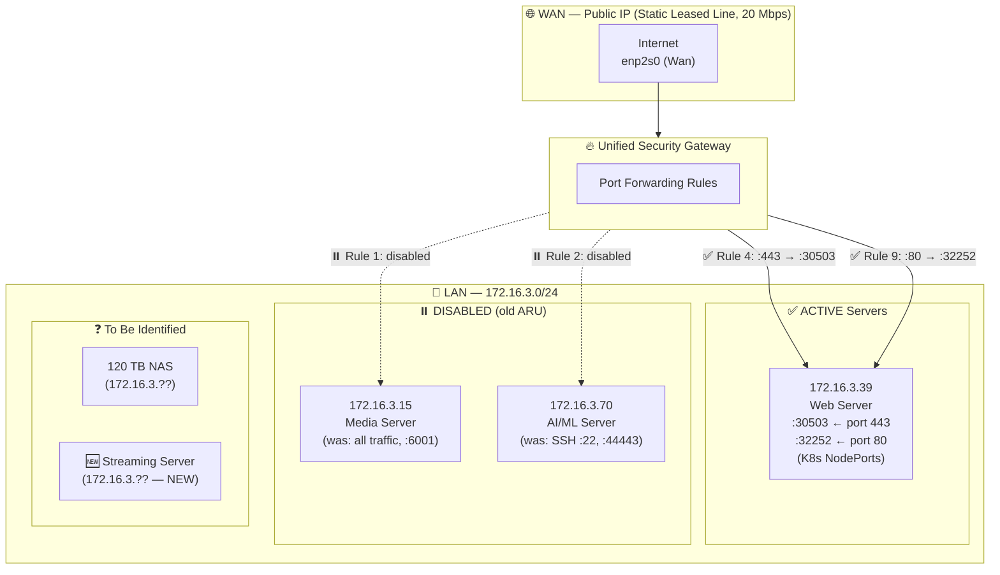
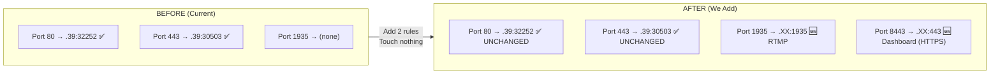
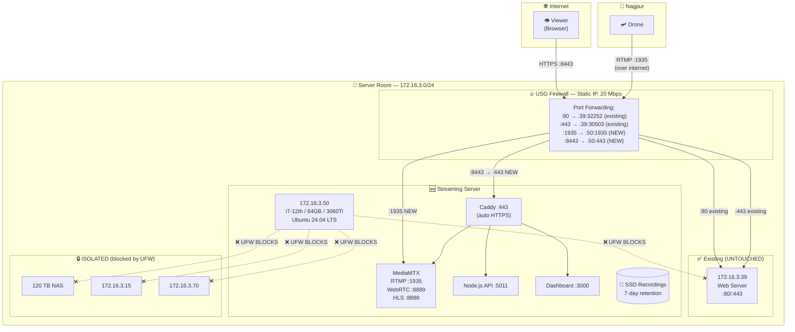

# Server Room Deployment & Firewall Integration Plan

## Your Current Network — What I See


### Current Server Room Map



### Existing Active Port Forwarding Rules

| Rule | Status | WAN Port | → LAN Destination | Purpose | Impact on Us |
|:-----|:-------|:---------|:-------------------|:--------|:-------------|
| 4 | **✅ Enabled** | **443** | 172.16.3.39:**30503** | HTTPS to Web Server (K8s) | ⚠️ **Port 443 is TAKEN** |
| 5 | **✅ Enabled** | **443** (from 14.97.37.70) | 172.16.3.39:**30503** | Same, LAN hairpin | ⚠️ Same |
| 8 | **✅ Enabled** | **80** (from 14.97.37.70) | 172.16.3.39:**32252** | HTTP to Web Server | ⚠️ **Port 80 is TAKEN** |
| 9 | **✅ Enabled** | **80** | 172.16.3.39:**32252** | HTTP to Web Server | ⚠️ Same |

### Existing Disabled Rules (old ARU — DO NOT ENABLE)

| Rule | WAN Port | → LAN Destination | Notes |
|:-----|:---------|:-------------------|:------|
| 1 | ALL traffic | 172.16.3.15 | ❌ Dangerously broad — forwards everything to media server |
| 2 | 22 (SSH) | 172.16.3.70:22 | ❌ SSH exposed to WAN |
| 3 | 22 (SSH) | 172.16.3.39:22 | ❌ SSH exposed to WAN |
| 6 | 44443 | 172.16.3.70:44443 | Old reflexive NAT for AI server |
| 7 | 6001 | 172.16.3.15 | Old media server port |

> [!CAUTION]
> **Never re-enable Rules 1, 2, 3.** Rule 1 forwards ALL WAN traffic to the media server — that's a massive security hole. Rules 2 and 3 expose SSH to the internet. These should eventually be **deleted**, not just disabled.

---

## ⚠️ Critical Constraint: 20 Mbps Leased Line

This is the most important factor for your server room deployment:

```
                    20 Mbps Leased Line (Symmetric)
    ┌──────────────────────────────────────────────────┐
    │  ↓ DOWNLOAD (into server room)                   │
    │  • Drone RTMP ingest: ~4-6 Mbps                  │
    │  • Web server traffic: ~1-2 Mbps                 │
    │  • Remaining: ~12-14 Mbps                        │
    │                                                  │
    │  ↑ UPLOAD (out to viewers)                       │
    │  • Web server responses: ~2-3 Mbps               │
    │  • Remaining for streaming: ~17 Mbps             │
    │  • Per viewer at 1080p/6Mbps: ~3 viewers max     │
    │  • Per viewer at 720p/3Mbps:  ~5 viewers max     │
    │  • Per viewer at 480p/1.5Mbps: ~11 viewers max   │
    └──────────────────────────────────────────────────┘
```

| Drone Quality | Bitrate | Max Remote Viewers (20 Mbps) |
|:-------------|:--------|:---------------------------|
| 1080p | 6 Mbps | **2-3 viewers** |
| 720p | 3 Mbps | **4-5 viewers** |
| 720p (lower bitrate) | 2 Mbps | **6-7 viewers** |
| 480p | 1.5 Mbps | **8-10 viewers** |

> [!IMPORTANT]
> **20 Mbps is tight.** At your office (400 Mbps) you can serve 50+ viewers easily. In the server room, you're limited to **3-5 remote viewers at 720p-1080p**. This is fine if it's only a small operations team watching. If you need more viewers, we'll discuss options at the end.

---

## Safe Deployment Strategy

### Principle: **ADD only, NEVER modify existing rules**



### Step-by-Step: What to Do on the USG

#### Step 1: Assign a Static LAN IP for the Streaming Server

On the streaming server (Ubuntu):
```bash
# /etc/netplan/01-netcfg.yaml
network:
  version: 2
  ethernets:
    enp0s31f6:  # Replace with your actual interface name
      dhcp4: no
      addresses:
        - 172.16.3.50/24       # Pick an unused IP
      routes:
        - to: default
          via: 172.16.3.1      # Your gateway (USG LAN IP)
      nameservers:
        addresses: [8.8.8.8, 1.1.1.1]
```

Apply: `sudo netplan apply`

#### Step 2: Add Port Forwarding Rules on USG (2 new rules only)

Add these **new** rules to your USG. **Do not touch existing rules 1-9.**

| New Rule | Status | Zone | Interface | Protocol | Src Port | Dest IP | Dest Port | Description |
|:---------|:-------|:-----|:----------|:---------|:---------|:--------|:----------|:------------|
| **10** | **Enabled** | wan | enp2s0 (Wan) | **tcp** | **1935** | **172.16.3.50** | **1935** | RTMP_Drone_Ingest |
| **11** | **Enabled** | wan | enp2s0 (Wan) | **tcp** | **8443** | **172.16.3.50** | **443** | HTTPS_Stream_Dashboard |

> [!NOTE]
> - We use port **8443** externally for the dashboard because **443 is already taken** by the web server (.39)
> - RTMP on **1935** is not in conflict with anything (old Rule 8 is for .15 and is disabled)
> - We use **tcp only** — not "all" — to minimize attack surface

#### Step 3: Add Firewall Accept Rules on USG

Add matching accept rules in the **Rules** section:

| New Rule | Status | Description | Protocol | Src Zone | Dest Zone | Dest Port | Action |
|:---------|:-------|:------------|:---------|:---------|:----------|:----------|:-------|
| **11** | Enabled | RTMP_to_StreamServer | tcp | wan | lan | 1935 | ACCEPT |
| **12** | Enabled | HTTPS_to_StreamServer | tcp | wan | lan | 8443 | ACCEPT |

#### Step 4: Lock Down the Streaming Server (UFW on Ubuntu)

On the streaming server itself — **block access to all other LAN servers**:

```bash
#!/bin/bash
# Run on the streaming server (172.16.3.50)

# === BLOCK access to other servers and NAS ===
sudo ufw deny out to 172.16.3.39    # Web server — BLOCKED
sudo ufw deny out to 172.16.3.15    # Media server — BLOCKED
sudo ufw deny out to 172.16.3.70    # AI/ML server — BLOCKED
# Add NAS IP when you confirm it:
# sudo ufw deny out to 172.16.3.XX  # NAS — BLOCKED

# === Allow inbound services ===
sudo ufw allow 1935/tcp             # RTMP (drone ingest)
sudo ufw allow 443/tcp              # HTTPS (Caddy → dashboard)
sudo ufw allow 8889/tcp             # WebRTC signaling (WHEP)
sudo ufw allow 8889/udp             # WebRTC media
sudo ufw allow 8888/tcp             # HLS playback
sudo ufw allow 22/tcp               # SSH (from LAN only, see below)

# === Restrict SSH to LAN only ===
sudo ufw delete allow 22/tcp
sudo ufw allow from 172.16.3.0/24 to any port 22 proto tcp

# === Allow outbound essentials only ===
sudo ufw default deny outgoing
sudo ufw allow out to any port 53             # DNS
sudo ufw allow out to any port 80 proto tcp   # apt updates, Docker pulls
sudo ufw allow out to any port 443 proto tcp  # HTTPS (apt, Docker)
sudo ufw allow out on docker0                 # Docker internal
sudo ufw allow out on br-+                    # Docker bridge networks

# === Enable ===
sudo ufw --force enable
sudo ufw status verbose
```

After this, even if the streaming server is compromised:
```
Streaming Server (172.16.3.50)
  → 172.16.3.39 (Web Server)     ❌ BLOCKED
  → 172.16.3.15 (Media Server)   ❌ BLOCKED  
  → 172.16.3.70 (AI/ML Server)   ❌ BLOCKED
  → 172.16.3.XX (NAS)            ❌ BLOCKED
  → Internet (apt/docker only)   ✅ Port 80/443 only
```

---

## Final Network Topology (After Deployment)



### What Viewers Access

| Resource | URL | Port on USG |
|:---------|:----|:------------|
| **Existing Web Server** | `https://yourdomain.com` | 443 → .39:30503 (unchanged) |
| **Stream Dashboard** | `https://yourdomain.com:8443` | 8443 → .50:443 (NEW) |
| **RTMP Ingest (drone)** | `rtmp://yourdomain.com:1935/live/{key}` | 1935 → .50:1935 (NEW) |
| **HLS Playback** | Via dashboard (proxied through Caddy :443) | Through 8443 |
| **WebRTC Playback** | Via dashboard (WebRTC negotiation via Caddy) | Through 8443 + UDP |

---

## Phased Rollout Plan

### Phase 1: Office Testing (NOW — Your 400 Mbps Office)

```
Week 1-2: Build & test everything locally
├── Docker Compose up on your current machine
├── Test with FFmpeg test patterns
├── Test with OBS Studio
├── Test WebRTC + HLS playback
├── Test recording + 7-day auto-delete
├── Test VOD dashboard
└── Verify all features work
```

### Phase 2: Remote Drone Test (Office)

```
Week 3: Test Nagpur → Office (400 Mbps)
├── Configure drone RTMP to your office public IP
├── Test latency (expect ~300-500ms WebRTC)
├── Test recording auto-start on drone takeoff
├── Test multiple viewers
└── Stress test with multiple drones
```

### Phase 3: Server Room Migration

```
Week 4: Deploy to server room
├── Step 1: Install Ubuntu on new server at 172.16.3.50
├── Step 2: Run setup-ubuntu.sh (Docker, NVIDIA, UFW)
├── Step 3: Copy project files, docker compose up
├── Step 4: Test on LAN first (no firewall rules yet)
├── Step 5: Add 2 USG port forwarding rules (1935, 8443)
├── Step 6: Add 2 USG accept rules
├── Step 7: Test drone from Nagpur → server room
├── Step 8: Test remote viewer access
├── Step 9: Verify existing web server (.39) still works ← CRITICAL
└── Step 10: Monitor for 48 hours
```

### Rollback Plan (If Anything Goes Wrong)

```
IF existing services disrupted:
  1. DISABLE rules 10 and 11 on USG (the 2 NEW ones)
  2. Everything reverts to exactly how it was before
  3. Streaming server is isolated, no impact on anything else
  
Total rollback time: < 2 minutes (toggle 2 rules)
```

---

## Addressing the 20 Mbps Bandwidth Limit

### Option A: Accept the Limit (Simplest — Recommended if ≤5 viewers)

If only 3-5 people need to watch the drone feed:
- Stream at **720p / 2-3 Mbps** from the drone
- Serves **5-7 concurrent viewers** comfortably
- **No extra cost, no complexity**

### Option B: Cloudflare Tunnel for Dashboard + Direct Video (Hybrid)

Use Cloudflare Tunnel (free) for the dashboard only, keep video direct:
- Dashboard protected behind Cloudflare (DDoS, hides IP)
- Video still limited by 20 Mbps
- Frees port 8443 (dashboard goes through tunnel, no port forward needed)
- **Only 1 USG rule needed** (port 1935 for RTMP ingest)

### Option C: Add Cloudflare Stream for Distribution (if many viewers needed)

If you later need 20+ viewers:
```
Drone → Your Server (records locally) → Re-stream to Cloudflare Stream → CDN → Viewers
```
- Upload to Cloudflare uses ~6 Mbps of your 20 Mbps
- Cloudflare CDN serves unlimited viewers globally
- Extra cost: ~\$1/1000 min delivered
- Latency increases to 6-15s
- **Add this LATER only if you hit the viewer limit**

> [!TIP]
> **Start with Option A.** If you find 20 Mbps isn't enough, move to Option C. You don't need to decide now — the architecture supports adding Cloudflare Stream later without changing anything on the server.

---

## Open Questions

> [!IMPORTANT]
> **NAS IP address**: What is the IP of your 120 TB NAS on the `172.16.3.0/24` network? I need it for the UFW block rules.

> [!IMPORTANT]
> **Gateway IP**: Is your USG's LAN gateway `172.16.3.1`? Need this for the streaming server's static IP config.

> [!IMPORTANT]
> **Available IP**: Is `172.16.3.50` free on your network, or should we use a different IP for the streaming server?

> [!IMPORTANT]
> **Viewer count**: How many people will typically watch the drone feed simultaneously? This determines if 20 Mbps is sufficient or if we need Cloudflare Stream for distribution.

> [!IMPORTANT]
> **Domain**: Will you use a subdomain of your existing domain (e.g., `stream.yourdomain.com`) or a separate domain?
