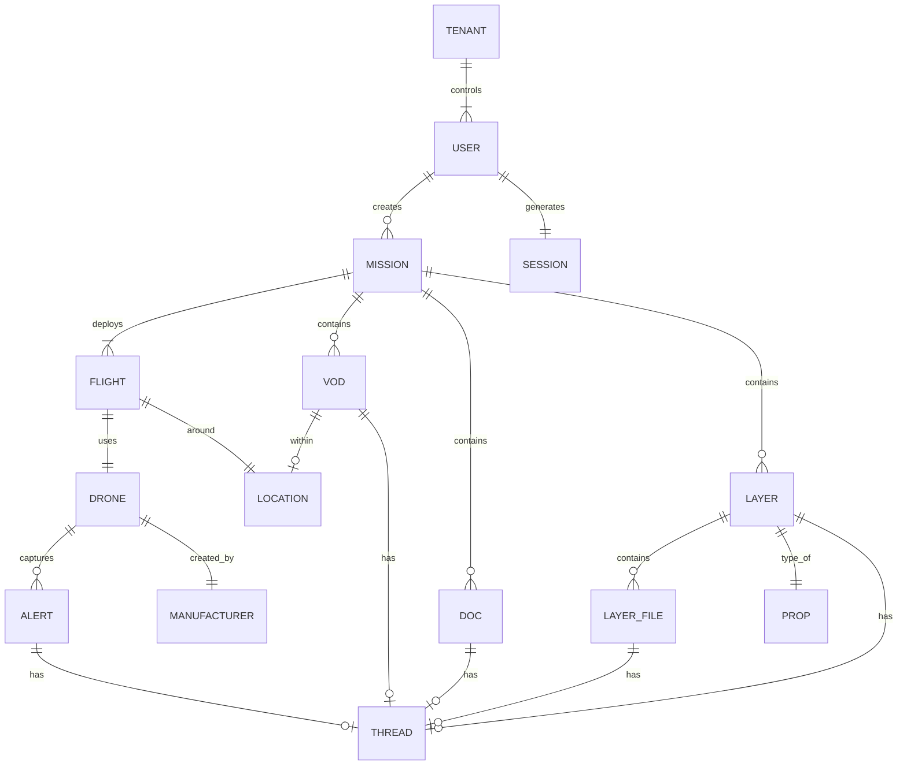

# ARU Platform — Database Architecture & Data Schema

## 1. Database Technology
- **Engine**: MongoDB (document-oriented NoSQL)
- **Docker Image**: `mongo@sha256:06cd2e814b2641d4c7ac6b093e870fe72c1ddbc7c6ddaaef16d4cb5a61c0ee6b`
- **Connection String**: `mongodb://mongodb:27017/test`
- **Default Database**: `test`
- **Session Store**: `sessions` collection (via connect-mongo)
- **Authentication**: No MongoDB auth configured (open access within Docker network)

## 2. Entity Relationship Diagram

## 3. Collections & Schema Detail

### 3.1 tenants
| Field | Type | Required | Description |
|---|---|---|---|
| _id | ObjectId | Yes | Unique identifier for the tenant |
| name | String | [PLACEHOLDER: required status] | Tenant name |
| phoneNo | String | [PLACEHOLDER: required status] | Contact phone number |
| email | String | [PLACEHOLDER: required status] | Contact email address |
| contactPerson | String | [PLACEHOLDER: required status] | Name of the contact person |
| registrationNumber | String | [PLACEHOLDER: required status] | Business registration number |
| gstNumber | String | [PLACEHOLDER: required status] | GST tax identification number |
| billingAddressLine1-2 | String | [PLACEHOLDER: required status] | Billing address lines |
| billingCity | String | [PLACEHOLDER: required status] | Billing city |
| billingDistrict | String | [PLACEHOLDER: required status] | Billing district |
| billingState | String | [PLACEHOLDER: required status] | Billing state |
| billingPin | String | [PLACEHOLDER: required status] | Billing postal code |
| avatar | String | [PLACEHOLDER: required status] | Path to tenant logo |
| officialWebsite | String | [PLACEHOLDER: required status] | Official website URL |
| isActive | Boolean | [PLACEHOLDER: required status] | Active status flag |
| isActivated | Boolean | [PLACEHOLDER: required status] | Account activated status flag |
| activePackage | ObjectId | [PLACEHOLDER: required status] | Reference to active package in packages collection |
| packageStartDate | Date | [PLACEHOLDER: required status] | Start date of the current active package |
| storageUsed | Number | [PLACEHOLDER: required status] | Amount of storage currently used |
| bandwidthUsed | Number | [PLACEHOLDER: required status] | Amount of bandwidth currently used |
| actualAlertCount | Number | [PLACEHOLDER: required status] | Usage counter for alerts |
| actualClientCount | Number | [PLACEHOLDER: required status] | Usage counter for clients |
| actualLayerCount | Number | [PLACEHOLDER: required status] | Usage counter for layers |
| actualLocationCount | Number | [PLACEHOLDER: required status] | Usage counter for locations |
| actualMissionCount | Number | [PLACEHOLDER: required status] | Usage counter for missions |
| actualUserCount | Number | [PLACEHOLDER: required status] | Usage counter for users |
| actualUserGroupCount | Number | [PLACEHOLDER: required status] | Usage counter for user groups |
| actualVodCount | Number | [PLACEHOLDER: required status] | Usage counter for VODs |
| actualSize | Decimal128 | [PLACEHOLDER: required status] | Actual size usage |
| publicMapRef | String | [PLACEHOLDER: required status] | Public map sharing key |
| upcomingPackages | Array | [PLACEHOLDER: required status] | List of scheduled future packages |
| modefiedEmailRequestedOTPs | Array | [PLACEHOLDER: required status] | OTPs requested for email modification |
| modefiedphoneNoRequestedOTPs | Array | [PLACEHOLDER: required status] | OTPs requested for phone number modification |

### 3.2 users
| Field | Type | Required | Description |
|---|---|---|---|
| _id | ObjectId | Yes | Unique identifier |
| name | String | [PLACEHOLDER: required status] | User's full name |
| email | String | [PLACEHOLDER: required status] | User's email address |
| phoneNo | String | [PLACEHOLDER: required status] | User's phone number |
| userType | enum | [PLACEHOLDER: required status] | Role: 'super-admin', 'tenant-root', 'tenant-staff', 'tenant-client' |
| password | String | [PLACEHOLDER: required status] | bcrypt hash of user password |
| tenantId | ObjectId | [PLACEHOLDER: required status] | Reference to tenants collection |
| userGroupId | ObjectId | [PLACEHOLDER: required status] | Reference to usergroups collection |
| customPermissions | Array of String | [PLACEHOLDER: required status] | List of user-specific permissions |
| isActive | Boolean | [PLACEHOLDER: required status] | Active status flag |
| isBanned | Boolean | [PLACEHOLDER: required status] | Banned status flag |
| avatar | String | [PLACEHOLDER: required status] | Path to user's avatar image |
| isTermsAccepted | Boolean | [PLACEHOLDER: required status] | Flag indicating acceptance of terms |
| loginOtps | Array | [PLACEHOLDER: required status] | Requested login OTPs |
| loginRequested | Boolean | [PLACEHOLDER: required status] | Flag indicating an active login request |
| passwordResetToken | String | [PLACEHOLDER: required status] | Token for resetting password |

### 3.3 packages
| Field | Type | Required | Description |
|---|---|---|---|
| _id | ObjectId | Yes | Unique identifier |
| name | String | [PLACEHOLDER: required status] | Package name |
| bandwidth | Number | [PLACEHOLDER: required status] | Bandwidth limit |
| storage | Number | [PLACEHOLDER: required status] | Storage limit |
| duration | Number | [PLACEHOLDER: required status] | Package duration |
| userCount | Number | [PLACEHOLDER: required status] | Allowed number of users |
| missionCount | Number | [PLACEHOLDER: required status] | Allowed number of missions |
| layerCount | Number | [PLACEHOLDER: required status] | Allowed number of layers |
| alertCount | Number | [PLACEHOLDER: required status] | Allowed number of alerts |
| vodCount | Number | [PLACEHOLDER: required status] | Allowed number of VODs |
| clientCount | Number | [PLACEHOLDER: required status] | Allowed number of clients |
| locationCount | Number | [PLACEHOLDER: required status] | Allowed number of locations |
| userGroupCount | Number | [PLACEHOLDER: required status] | Allowed number of user groups |
| price | Number | [PLACEHOLDER: required status] | Cost of the package |
| poster | String | [PLACEHOLDER: required status] | Package thumbnail/poster path |
| isActive | Boolean | [PLACEHOLDER: required status] | Active status flag |

### 3.4 usergroups
| Field | Type | Required | Description |
|---|---|---|---|
| _id | ObjectId | Yes | Unique identifier |
| name | String | [PLACEHOLDER: required status] | Name of the user group |
| permissions | Array of String | [PLACEHOLDER: required status] | List of permissions (e.g., 'mission_create', 'upload_layer', 'client_list') |
| isActive | Boolean | [PLACEHOLDER: required status] | Active status flag |
| tenantId | ObjectId | [PLACEHOLDER: required status] | Reference to tenants collection |

### 3.5 missions
| Field | Type | Required | Description |
|---|---|---|---|
| _id | ObjectId | Yes | Unique identifier |
| name | String | [PLACEHOLDER: required status] | Name of the mission |
| description | String | [PLACEHOLDER: required status] | Mission description |
| deliverables | Array of String | [PLACEHOLDER: required status] | List of deliverables (e.g., 'Orthomosaic', 'DEM', 'DTM') |
| status | enum | [PLACEHOLDER: required status] | Current status (e.g., 'Completed', 'Live') |
| user | ObjectId | [PLACEHOLDER: required status] | Reference to users collection |
| assetID | ObjectId | [PLACEHOLDER: required status] | Reference to assets collection |
| tenantId | ObjectId | [PLACEHOLDER: required status] | Reference to tenants collection |
| missionType | ObjectId | [PLACEHOLDER: required status] | Reference to missiontypes collection |
| clientId | Array of ObjectId | [PLACEHOLDER: required status] | References to clients in users collection |
| invites | Array | [PLACEHOLDER: required status] | List of invitations sent |
| size | Number | [PLACEHOLDER: required status] | Total size of the mission |
| isPublic | Boolean | [PLACEHOLDER: required status] | Flag indicating if mission is publicly accessible |

### 3.6 missiontypes
| Field | Type | Required | Description |
|---|---|---|---|
| _id | ObjectId | Yes | Unique identifier |
| name | String | [PLACEHOLDER: required status] | Type name (e.g., 'Mapping', 'Surveillance') |
| description | String | [PLACEHOLDER: required status] | Description of the mission type |
| isActive | Boolean | [PLACEHOLDER: required status] | Active status flag |

### 3.7 flights
| Field | Type | Required | Description |
|---|---|---|---|
| _id | ObjectId | Yes | Unique identifier |
| name | String | [PLACEHOLDER: required status] | Flight name |
| date | String | [PLACEHOLDER: required status] | Date of the flight |
| geoLocation | String | [PLACEHOLDER: required status] | Reverse geocoded address |
| centerPoints | Object | [PLACEHOLDER: required status] | Center coordinates {lng, lat} |
| locationID | ObjectId | [PLACEHOLDER: required status] | Reference to locations collection |
| assetID | ObjectId | [PLACEHOLDER: required status] | Reference to assets collection |
| time | String | [PLACEHOLDER: required status] | Time of the flight |
| duration | String | [PLACEHOLDER: required status] | Duration of the flight |
| geoFence | Object | [PLACEHOLDER: required status] | Geofence boundaries {polygon, circle: {radius, area, center}} |
| client | ObjectId | [PLACEHOLDER: required status] | Reference to client user |
| tenant | ObjectId | [PLACEHOLDER: required status] | Reference to tenants collection |
| pilotID | ObjectId | [PLACEHOLDER: required status] | Reference to pilot user |
| mission | ObjectId | [PLACEHOLDER: required status] | Reference to missions collection |

### 3.8 layers
| Field | Type | Required | Description |
|---|---|---|---|
| _id | ObjectId | Yes | Unique identifier |
| name | String | [PLACEHOLDER: required status] | Layer name |
| type | enum | [PLACEHOLDER: required status] | Type of layer: 'Vector', 'Raster' |
| vector | String | [PLACEHOLDER: required status] | Subtype for vector (e.g., 'Plot', 'Building Footprint', 'Waterbody', 'Green Verge', 'Landmark', 'Jungle', 'Cycle Track', 'Garbage Collection Point', 'Block Boundary') |
| raster | String | [PLACEHOLDER: required status] | Subtype for raster (e.g., 'ORTHO') |
| missionId | ObjectId | [PLACEHOLDER: required status] | Reference to missions collection |
| color | String | [PLACEHOLDER: required status] | Display color (hex or 'multicolor') |
| fileSize | Number | [PLACEHOLDER: required status] | Size of the layer file |
| layerpath | String | [PLACEHOLDER: required status] | Path to file in S3/MinIO |
| featureCount | Number | [PLACEHOLDER: required status] | Number of features in the layer |
| layers | Array | [PLACEHOLDER: required status] | Sub-layers array |
| layerGroupId | ObjectId | [PLACEHOLDER: required status] | Reference to layergroups collection |
| captureDate | Date | [PLACEHOLDER: required status] | Date the layer data was captured |
| tenantId | ObjectId | [PLACEHOLDER: required status] | Reference to tenants collection |
| layerLabel | String | [PLACEHOLDER: required status] | Label of the layer |
| isBase | Boolean | [PLACEHOLDER: required status] | Flag indicating if this is a base layer |
| isPublic | Boolean | [PLACEHOLDER: required status] | Flag indicating if layer is publicly accessible |
| publicMapRef | String | [PLACEHOLDER: required status] | Public map sharing key |
| layerdataArr | Array | [PLACEHOLDER: required status] | Array containing layer data elements |
| center | Array | [PLACEHOLDER: required status] | Center coordinates |
| flaggedFeatures | Array of Number | [PLACEHOLDER: required status] | List of flagged feature indices |
| isFlagged | Boolean | [PLACEHOLDER: required status] | Flag indicating if layer has flagged features |
| isThreadExist | Boolean | [PLACEHOLDER: required status] | Flag indicating if a discussion thread exists |
| commentCount | Number | [PLACEHOLDER: required status] | Number of comments on the layer |
| metadata | Object | [PLACEHOLDER: required status] | Metadata object (e.g., {searchIndexPath: String}) |

### 3.9 layerfiles
| Field | Type | Required | Description |
|---|---|---|---|
| _id | ObjectId | Yes | Unique identifier |
| name | String | [PLACEHOLDER: required status] | Layer file name |
| layerId | ObjectId | [PLACEHOLDER: required status] | Reference to layers collection |
| sys_Id | String | [PLACEHOLDER: required status] | System identifier |
| featureLabel | String | [PLACEHOLDER: required status] | Label for the feature |
| fileSize | Number | [PLACEHOLDER: required status] | Size of the file |
| centerPoints | Object | [PLACEHOLDER: required status] | Center coordinates {lng, lat} |
| filePath | String | [PLACEHOLDER: required status] | Path to the file |
| fileType | String | [PLACEHOLDER: required status] | Type of the file |
| tenantId | ObjectId | [PLACEHOLDER: required status] | Reference to tenants collection |
| isReview | Boolean | [PLACEHOLDER: required status] | Flag indicating review status |
| isThreadExist | Boolean | [PLACEHOLDER: required status] | Flag indicating if a discussion thread exists |
| commentCount | Number | [PLACEHOLDER: required status] | Number of comments |

### 3.10 assets (Drones)
| Field | Type | Required | Description |
|---|---|---|---|
| _id | ObjectId | Yes | Unique identifier |
| assetName | String | [PLACEHOLDER: required status] | Name of the asset |
| assetInfo | Array of Objects | [PLACEHOLDER: required status] | Asset specifics: [{UIN, FCID, serialNO}] |
| userID | ObjectId | [PLACEHOLDER: required status] | Reference to users collection |
| tenantID | ObjectId | [PLACEHOLDER: required status] | Reference to tenants collection |
| isActive | Boolean | [PLACEHOLDER: required status] | Active status flag |
| modelID | ObjectId | [PLACEHOLDER: required status] | Reference to models collection |
| assetOwner | ObjectId | [PLACEHOLDER: required status] | Reference to users collection |
| manufactureDate | Date | [PLACEHOLDER: required status] | Date of manufacture |
| manufactureID | ObjectId | [PLACEHOLDER: required status] | Reference to manufacturers collection |

### 3.11 models (Drone Models)
| Field | Type | Required | Description |
|---|---|---|---|
| _id | ObjectId | Yes | Unique identifier |
| modelName | String | [PLACEHOLDER: required status] | Name of the model |
| modelNumber | String | [PLACEHOLDER: required status] | Model number |
| assetClassID | ObjectId | [PLACEHOLDER: required status] | Reference to assetclasses collection |
| dimensions | Object | [PLACEHOLDER: required status] | Physical dimensions {length, breadth, height} |
| manufacturerID | ObjectId | [PLACEHOLDER: required status] | Reference to manufacturers collection |
| website | String | [PLACEHOLDER: required status] | Model website URL |
| tenantID | ObjectId | [PLACEHOLDER: required status] | Reference to tenants collection |
| props | Object | [PLACEHOLDER: required status] | Additional properties (e.g., {Payloads: string}) |

### 3.12 assetclasses
| Field | Type | Required | Description |
|---|---|---|---|
| _id | ObjectId | Yes | Unique identifier |
| typeName | String | [PLACEHOLDER: required status] | Type name (e.g., 'drone') |

### 3.13 manufacturers
| Field | Type | Required | Description |
|---|---|---|---|
| _id | ObjectId | Yes | Unique identifier |
| name | String | [PLACEHOLDER: required status] | Name of the manufacturer |
| address | String | [PLACEHOLDER: required status] | Physical address |
| nationality | String | [PLACEHOLDER: required status] | Nationality or origin |
| website | String | [PLACEHOLDER: required status] | Official website |
| contacts | Array of Objects | [PLACEHOLDER: required status] | Contact individuals: [{name, designation, Mobile, email}] |
| tenantID | ObjectId | [PLACEHOLDER: required status] | Reference to tenants collection |

### 3.14 streamkeys
| Field | Type | Required | Description |
|---|---|---|---|
| _id | ObjectId | Yes | Unique identifier |
| isActive | Boolean | [PLACEHOLDER: required status] | Active status flag |
| pStatus | Boolean | [PLACEHOLDER: required status] | Processing/Platform status flag |
| streamKey | String | [PLACEHOLDER: required status] | Base64 encoded stream key |
| tenantID | ObjectId | [PLACEHOLDER: required status] | Reference to tenants collection |
| assetID | ObjectId | [PLACEHOLDER: required status] | Reference to assets collection |
| missionID | ObjectId | [PLACEHOLDER: required status] | Reference to missions collection |
| flightID | ObjectId | [PLACEHOLDER: required status] | Reference to flights collection |
| locationID | ObjectId | [PLACEHOLDER: required status] | Reference to locations collection |

### 3.15 locations
| Field | Type | Required | Description |
|---|---|---|---|
| _id | ObjectId | Yes | Unique identifier |
| geometry | Object | [PLACEHOLDER: required status] | GeoJSON point {type: 'Point', coordinates: [lng, lat]} |
| properties | Object | [PLACEHOLDER: required status] | Location properties (e.g., {name: String}) |
| tenantId | ObjectId | [PLACEHOLDER: required status] | Reference to tenants collection |

### 3.16 permissions
Permissions are managed in the code but seeded via `usergroups`. 
Known permission strings include:
- `mission_create`
- `mission_type_list`
- `location_list`
- `user_list`
- `mission_list`
- `client_list`
- `layer_list`
- `create_client`
- `edit_client`
- `delete_client`
- `user_group_list`
- `client_data`
- `upload_layer`
- [PLACEHOLDER: any other permissions]

### Additional Collections
Other collections referenced in the code include:
- `alerts`
- `threads`
- `vods`
- `documents`
- `flightlogs`
- `invites`
- `payments`
- `passwordresets`
- `uploadtasks`
- `aimltasks`
- `thermalpoints`
- `rasterprops`
- `vectorprops`
- `layergroups`
- `baselayers`

## 4. Indexes
Database indexes should be thoroughly verified in the production environment to ensure query efficiency. Key fields that likely need indexes include:
- `tenantId` (on most collections for multi-tenant querying)
- `email` (on `users` collection)
- `missionId` (on `layers`, `flights` collections)
- `layerId` (on `layerfiles` collection)
- [PLACEHOLDER: other identified key fields]

## 5. Multi-Tenancy Model
Every collection includes a `tenantId` field to support multiple tenants within the single database. Data isolation is strictly enforced at the application layer — all database queries always filter by the authenticated user's `tenantId`. There is no built-in database-level tenant isolation, relying completely on application-level filtering.

## 6. Object Storage (MinIO / S3)
- **Bucket**: `aru`
- **Access**: `minioadmin` / `minioadmin` (default credentials)
- **Stores**: 
  - Raster files (GeoTIFF)
  - Vector files (GeoJSON)
  - Video files (MP4, HLS)
  - Thumbnails
  - Documents
  - Images
  - Reports
- **Path patterns**: 
  - `/raster/*`
  - `/vector/*`
  - `/images/*`
  - `/video/*`
  - [PLACEHOLDER: any additional paths]
