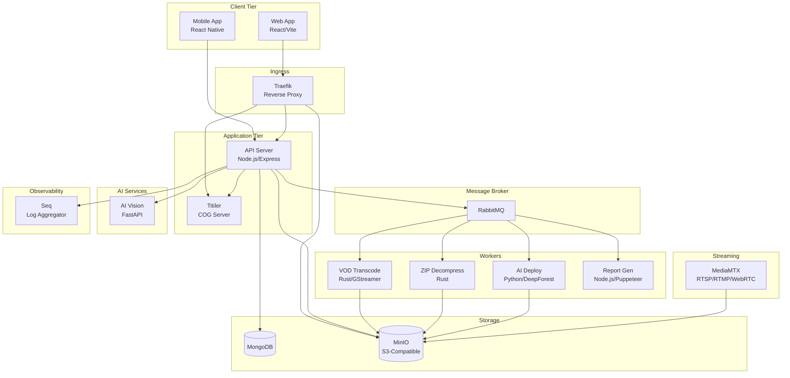

# ARU Platform — Microservices Architecture

## 1. Architecture Overview



## 2. Service Details

### 2.1 API Server (./server)
- **Technology**: Node.js 22, TypeScript, Express
- **Port**: 5011 (mapped to 80 in container)
- **Purpose**: Central API gateway and business logic
- **Dependencies**: MongoDB, MinIO, RabbitMQ, Titiler, Redis
- **Resource Limits**: 2GB RAM, 4GB swap, 1.5 CPU
- **Key Features**:
  - RESTful API endpoints
  - Session-based authentication
  - Socket.io WebSockets (via RabbitMQ adapter)
  - File upload management
  - Sends tasks to workers via RabbitMQ
  - Pino logging with Loki/Seq forwarding

### 2.2 Web Client (./client)
- **Technology**: React 18, TypeScript, Vite 5, Ant Design
- **Port**: 3000 (mapped to 80 via Nginx)
- **Purpose**: Dashboard web application
- **Key Features**:
  - Mapbox GL + DeckGL for GIS visualization
  - Runtime environment injection via entrypoint.sh
  - Gulp-compiled Less themes
  - Playwright E2E tests

### 2.3 VOD Transcoder (./vod-transcode)
- **Technology**: Rust, GStreamer
- **Communication**: RabbitMQ (queue: vod.transcode.req → vod.transcode.res)
- **Purpose**: Transcode uploaded MP4 video files to HLS format with thumbnails and SRT subtitles
- **Data Flow**:
  1. Server publishes transcode request to RabbitMQ
  2. Worker fetches MP4 from MinIO via GStreamer S3 plugin
  3. Transcodes to HLS segments
  4. Extracts thumbnail
  5. Processes SRT subtitles
  6. Uploads results to MinIO
  7. Publishes completion to RabbitMQ
- **Environment**: AWS_ACCESS_KEY_ID, AWS_SECRET_ACCESS_KEY, S3_BUCKET, S3_ENDPOINT, AMQP_ADDR

### 2.4 ZIP Decompressor (./zip-decompress)
- **Technology**: Rust (rc-zip-tokio, rust-s3)
- **Communication**: RabbitMQ (queue: file.decompress.req → file.decompress.res)
- **Purpose**: Extract ZIP archives containing 3D tilesets stored in MinIO
- **Data Flow**:
  1. Server publishes decompress request
  2. Worker streams ZIP from MinIO
  3. Extracts contents back to MinIO
  4. Publishes completion

### 2.5 AI Deploy Worker (./ai-deploy)
- **Technology**: Python, PyTorch, DeepForest, Rasterio
- **Communication**: RabbitMQ (queue: deepforest.infer.req → deepforest.infer.res)
- **Purpose**: Run tree detection inference on raster GeoTIFF images
- **Data Flow**:
  1. Receives inference request with MinIO file reference
  2. Downloads GeoTIFF from MinIO
  3. Runs DeepForest model inference
  4. Generates GeoJSON output with detected tree locations
  5. Uploads GeoJSON to MinIO
  6. Sends progress updates and final result via RabbitMQ
- **Dependencies**: pika, minio, torch, rasterio, deepforest

### 2.6 AI Vision Server (./ai-vision)
- **Technology**: Python, FastAPI
- **Communication**: HTTP (POST /)
- **Port**: 8008
- **Purpose**: HTTP-based AI inference for video violence detection, tree count, people count
- **Data Flow**:
  1. Receives HTTP request with target data URL and callback webhook
  2. Downloads data
  3. Runs inference
  4. POSTs results to callback URL
- **Sub-projects**: Tree_detection/, Tree Count/, people_count/

### 2.7 Livestream Server (./livestream)
- **Technology**: MediaMTX
- **Purpose**: Ingest and distribute live drone video streams
- **Protocols**: RTSP, RTMP, WebRTC, HLS
- **Storage**: rclone configured for MinIO to record streams
- **Configuration**: mediamtx.yml (extensive config for stream management)

### 2.8 Report Generator (./report-gen)
- **Technology**: Node.js, headless browser (Puppeteer/Playwright)
- **Communication**: RabbitMQ
- **Purpose**: Generate visual reports by capturing screenshots and charts from the web client
- **Data Flow**:
  1. Receives report request via RabbitMQ
  2. Opens headless browser to client URL
  3. Navigates to specific mission/layer views
  4. Captures screenshots and generates charts
  5. Compiles report
  6. Stores in MinIO
  7. Sends completion notification

### 2.9 Consumer Mobile App (./ConsumerApp)
- **Technology**: React Native (DroneAru)
- **Purpose**: iOS/Android app for viewing drone data on mobile
- **Features**: Maps (MapboxGL), live stream viewing, mission documents, alerts
- **Communication**: REST API (Axios) + Socket.io for real-time
- **State**: Redux

## 3. Infrastructure Services

### 3.1 MongoDB
- **Image**: mongo (pinned by SHA)
- **Port**: 27017
- **Volume**: mongodb → /data/db
- **Resources**: 512MB RAM, 1GB swap
- **Healthcheck**: mongosh ping every 30s

### 3.2 MinIO (S3-Compatible Object Storage)
- **Image**: minio/minio (pinned by SHA)
- **Ports**: 9000 (API), 9001 (Console)
- **Volume**: mediastore → /data
- **Default bucket**: aru (created by init container)
- **Access**: minioadmin/minioadmin

### 3.3 RabbitMQ
- **Image**: rabbitmq (pinned by SHA)
- **Resources**: 256MB RAM, 512MB swap
- **Healthcheck**: rabbitmq-diagnostics status every 30s
- **Purpose**: Message broker for worker task distribution and Socket.io adapter

### 3.4 Titiler
- **Image**: ghcr.io/developmentseed/titiler (pinned by SHA)
- **Port**: 8000
- **Resources**: 512MB RAM, 1GB swap, 1.5 CPU
- **Purpose**: Serve Cloud Optimized GeoTIFFs as map tiles

### 3.5 Seq
- **Image**: datalust/seq
- **Port**: 5341
- **Purpose**: Centralized log aggregation and search

### 3.6 Traefik
- **Image**: traefik:v3.1
- **Ports**: 80, 443, 8080 (dashboard)
- **TLS**: Let's Encrypt (ACME, currently staging)
- **Purpose**: Reverse proxy, TLS termination, request routing

## 4. Communication Patterns

| Pattern | Technology | Use Case |
|---------|------------|----------|
| Request-Response | HTTP/REST | Client ↔ Server, Server ↔ AI Vision, Server ↔ Titiler |
| Pub/Sub (Async) | RabbitMQ | Server → Workers (VOD, ZIP, AI, Report) |
| Real-time Streaming | Socket.io | Server → Client (drone telemetry, alerts, notifications) |
| Video Streaming | RTSP/RTMP/WebRTC | Drones → MediaMTX → Client |
| Object Storage | S3 API | All services ↔ MinIO |

## 5. Docker Image Management

Production images are pushed to a local registry at 172.16.3.32:5000. All Docker images are pinned by SHA256 digest for reproducibility. To rebuild:
```bash
# Build all images
docker compose build

# Tag and push to local registry
docker tag aru-server:latest 172.16.3.32:5000/aru-server:v1.5.2
docker push 172.16.3.32:5000/aru-server:v1.5.2
```
