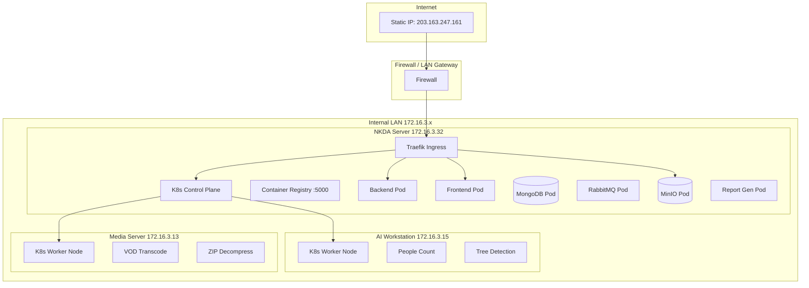

# ARU Platform — Infrastructure & Network Architecture

## 1. Production Server Topology



## 2. Server Details

| Server | IP Address | Role | SSH Access | Services |
| --- | --- | --- | --- | --- |
| NKDA Server | 172.16.3.32 | K8s Control Plane | `ssh server@172.16.3.32 -i credentials/kesowa` | Backend, Frontend, MongoDB, RabbitMQ, MinIO, Report Gen, Container Registry, Traefik Ingress |
| AI Workstation | 172.16.3.15 | K8s Worker | `ssh FS-AI@172.16.3.15` (via ProxyJump nkda) | People Count, Tree Detection |
| Media Server | 172.16.3.13 | K8s Worker | `ssh federalmds@172.16.3.13 -i credentials/kesowa` | VOD Transcode, ZIP Decompress |

## 3. Network Configuration

### 3.1 Internal Network
- **Subnet**: `172.16.3.0/24` (internal LAN)
- **Inter-node communication**: Direct LAN connectivity between all 3 servers
- **K8s networking**: Pod-to-pod communication via Kubernetes CNI
- **SSH**: ProxyJump required for AI Workstation (accessed through NKDA Server)

### 3.2 External Access
- **Static IP**: `203.163.247.161`
- **FTP**: Port 5023 (username: `kesowaFTP`)
- **HTTP/HTTPS**: Ports 80/443 via Traefik ingress

### 3.3 Port Mapping

| Service | Internal Port | External Port | Protocol |
| --- | --- | --- | --- |
| Web App (Frontend) | 3000 (mapped to 80 in container) | 443 (via Traefik) | HTTPS |
| API Server | 5011 (mapped to 80 in container) | 443 (via Traefik, path-based) | HTTPS |
| MongoDB | 27017 | Not exposed externally | TCP |
| RabbitMQ | 5672 | Not exposed externally | AMQP |
| MinIO API | 9000 | 443 (via Traefik) | HTTPS |
| MinIO Console | 9001 | `kubectl port-forward` | HTTPS |
| Titiler | 8000 (mapped to 80) | 443 (via Traefik) | HTTPS |
| Seq Logger | 5341 (mapped to 80) | Not exposed externally | HTTP |
| Traefik Dashboard | 8080 | Not exposed externally | HTTP |
| RTMP (Live Stream) | 1935 | 1935 | RTMP |
| Container Registry | 5000 | Not exposed externally | HTTP |
| FTP | 5023 | 5023 | FTP |

## 4. Kubernetes Cluster

### 4.1 Cluster Architecture
- **Control Plane**: NKDA Server (172.16.3.32)
- **Worker Nodes**: AI Workstation, Media Server
- **kubectl Config**: `credentials/nkda.conf` (API server at `https://127.0.0.1:6443`)
- **Ingress Controller**: Traefik (DaemonSet deployment)

### 4.2 Deployment Manifests

| File | Purpose | Dependencies |
| --- | --- | --- |
| **Core Configuration** | | |
| `main-config.yaml` | ConfigMap with environment variables | None |
| **Storage** | | |
| `mongo-claim.yaml` | PVC for MongoDB | None |
| `mongo-volume.yaml` | PV for MongoDB | None |
| `minio-claim.yaml` | PVC for MinIO | None |
| `minio-volumes.yaml` | PV for MinIO | None |
| `rabbit-claim.yaml` | PVC for RabbitMQ | None |
| **Infrastructure Services** | | |
| `mongodb.yaml` | MongoDB deployment | `mongo-claim.yaml`, `mongo-volume.yaml` |
| `minio.yaml` | MinIO deployment | `minio-claim.yaml`, `minio-volumes.yaml` |
| `minio-ingress.yaml` | MinIO ingress rules | `minio.yaml` |
| `rabbitmq.yaml` | RabbitMQ deployment | `rabbit-claim.yaml` |
| **Application Services** | | |
| `backend.yaml` | API Server deployment | MongoDB, RabbitMQ, MinIO, `main-config.yaml` |
| `backend-scale.yaml` | Backend HPA | `backend.yaml` |
| `backend-ingress.yaml` | Backend ingress rules | `backend.yaml` |
| `frontend.yaml` | Web client deployment | Backend API |
| `frontend-ingress.yaml` | Frontend ingress rules | `frontend.yaml` |
| **Tile Server** | | |
| `titiler.yaml` | Titiler deployment | `main-config.yaml` |
| `titiler-scale.yaml` | Titiler HPA | `titiler.yaml` |
| `titiler-ingress.yaml` | Titiler ingress rules | `titiler.yaml` |
| **Workers** | | |
| `decompress.yaml` | ZIP decompressor deployment | RabbitMQ, MinIO, `main-config.yaml` |
| `decompress-scale.yaml` | Decompressor HPA/scaling | `decompress.yaml` |
| `transcode.yaml` | VOD transcoder deployment | RabbitMQ, MinIO, `main-config.yaml` |
| `transcode-scale.yaml` | Transcoder HPA | `transcode.yaml` |
| `tree-detection.yaml` | AI tree detection deployment | RabbitMQ, MinIO, `main-config.yaml` |
| **TLS & Certificates** | | |
| `certificate.yaml` | TLS certificate resource | `cluster-issuer.yaml` |
| `cluster-issuer.yaml` | Cert-manager cluster issuer | Cert-manager |
| **Traefik (Ingress Controller)** | | |
| `traefik.yaml` | Traefik configuration | None |
| `traefik-ds.yaml` | Traefik DaemonSet | `traefik.yaml` |
| `traefik-perms.yaml` | Traefik permissions | None |
| `traefik-rbac.yaml` | Traefik RBAC | None |
| `traefik-services.yaml` | Traefik service definitions | None |
| `traefik-timeout.yaml` | Timeout middleware | None |
| `traefik-ui.yaml` | Traefik dashboard | None |
| `traefik-https-redirect-middleware.yaml` | HTTP→HTTPS redirect | None |
| **Monitoring** | | |
| `seq_logger.yaml` | Seq log aggregator | None |
| `mgob.yaml` | MongoDB backup tool | MongoDB |

### 4.3 Deployment Order
1. `main-config.yaml`
2. `minio-claim.yaml`
3. `minio.yaml`
4. `minio-ingress.yaml`
5. `mongo-claim.yaml`
6. `mongodb.yaml`
7. `rabbit-claim.yaml`
8. `rabbitmq.yaml`
9. `titiler.yaml`
10. `titiler-scale.yaml`
11. `titiler-ingress.yaml`
12. `decompress.yaml`
13. `decompress-scale.yaml`
14. `transcode.yaml`
15. `transcode-scale.yaml`
16. `backend.yaml`
17. `backend-scale.yaml`
18. `backend-ingress.yaml`
19. `frontend.yaml`
20. `frontend-ingress.yaml`
21. `cert-manager.yaml`
22. `cluster-issuer.yaml`
23. `certificate.yaml`
24. `tree-detection.yaml`

## 5. TLS / SSL Configuration

### Docker Compose (Development/Staging)
- **Traefik v3.1** handles TLS via Let's Encrypt ACME
- Currently configured for **ACME staging** server (not production)
- Certificate storage: Docker volume `letsencrypt`
- HTTP→HTTPS redirect configured on port 80
- To switch to production Let's Encrypt:
  ```yaml
  # In traefik.yaml, change:
  caServer: "https://acme-v02.api.letsencrypt.org/directory"
  ```

### K8s (Production)
- **cert-manager** with ClusterIssuer
- Certificate resource defined in `certificate.yaml`

## 6. SSH Access

```bash
# NKDA Server (direct access)
ssh -F sshconfig nkda

# Media Server (direct access)
ssh -F sshconfig media

# AI Workstation (via ProxyJump through NKDA)
ssh -F sshconfig aiwin
```

Credentials:
- **SSH key**: `credentials/kesowa` (private), `credentials/kesowa.pub` (public)
- **Root password** (all servers): `nkda@2025`
- **ServerAliveInterval**: 60 seconds

## 7. Container Registry
- **Type**: Local Docker registry
- **Address**: `172.16.3.32:5000` (`localhost:5000` on NKDA server)
- **Protocol**: HTTP (insecure registry — needs Docker daemon config)
- **Usage**: All production images are pushed here and referenced in K8s manifests

## 8. Firewall Considerations

- **Inbound**: `80` (HTTP), `443` (HTTPS), `1935` (RTMP), `5023` (FTP), `22` (SSH)
- **Internal**: `6443` (K8s API), `27017` (MongoDB), `5672` (RabbitMQ), `9000-9001` (MinIO), `5011` (API), `3000` (Client), `8000` (Titiler), `8008` (AI Vision)
- **Important**: Container registry at `:5000` should NOT be exposed externally

## 9. DNS Configuration

> [!NOTE]
> Domain names referenced in the codebase:
> - `kesowa.com` (vendor domain — may need to be replaced)
> - `cog.kesowa.com` (Titiler public endpoint)
> - `seq.kesowa.com` (Seq logging endpoint)
> - `[PLACEHOLDER: NKDA-specific domain name if applicable]`
>
> Traefik routes traffic based on Host headers. Update `.env` HOST variables to match your domain configuration.
